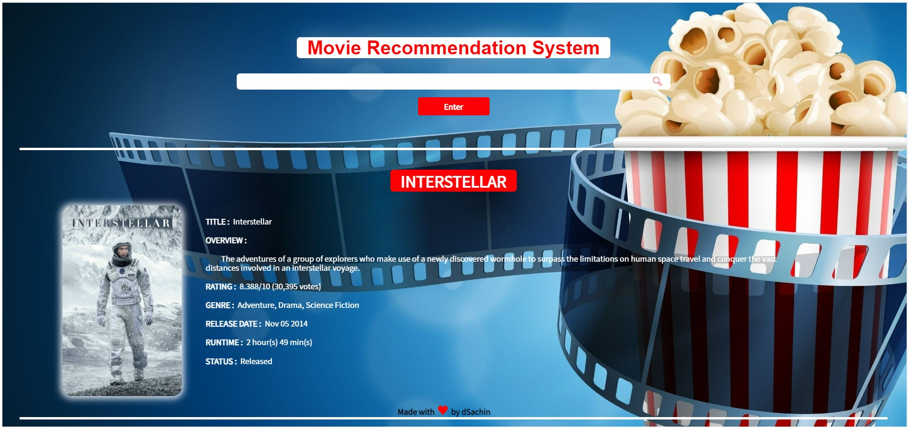

# Movie-Recommndation-System
  The Content Based Recommendation System uses attributes such as genre, director, description, actors, etc. for movies, to make suggestions for the users. The intuition behind this sort of recommendation system is that if a user liked a particular movie or show, he/she might like a movie or a show similar to it.

# Project-Screen-shot

